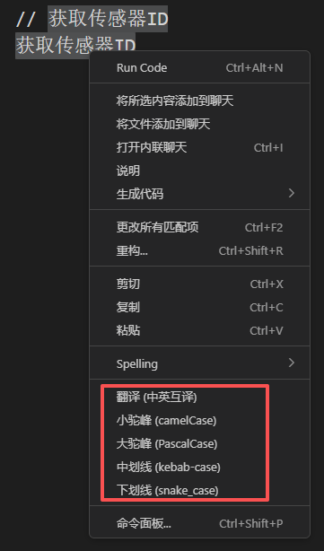
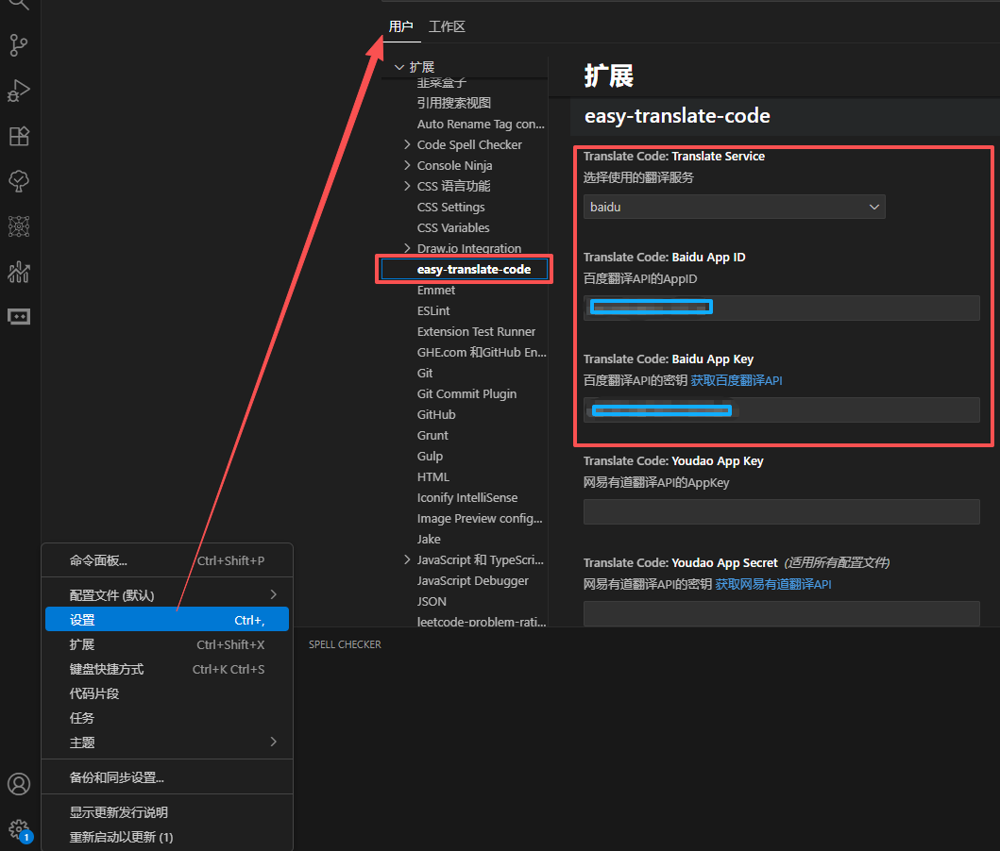

# 🚀 easy-translate-code

<div align="center">
  <p>🔤 代码翻译与格式转换助手 🔀</p>
  <p>⚡ 提升开发效率的必备工具 ⚡</p>
</div>

---

## 📝 项目简介

开发者自用插件，设计初衷用于快速将方法名和类名转换为驼峰或中划线格式，支持中英文互译及转换。

---

## 🎯 功能特性

- ✅ **命名格式转换**：驼峰命名、中划线命名等多种格式互转
- ✅ **中英文互译**：支持代码注释和标识符的中英文翻译
- ✅ **右键快捷操作**：选中内容后一键转换，高效便捷
- ✅ **基于百度/网易有道翻译 API**：提供高质量、专业的翻译结果

---

## 🛠️ 操作方法

选中内容后，右键菜单即可选择翻译或格式转换

<div align="center">
  
</div>

### 常用示例 1：注释转方法名

```js
// 获取传感器ID
const getSensorId = () => {};
```

### 常用示例 2：类选择器格式转换

```html
<!-- 如下，常用类选择器快速转换为中划线格式 -->
<div class="传感器ID列表"></div>
<!-- 转换后 -->
<div class="sensor-id-list"></div>
```

---

## 🔑 百度翻译 API 配置

### 打开设置配置 AppID 和密钥

在 VS Code 中，打开设置页面并配置百度翻译 API 的 AppID 和密钥。

<div align="center">
  
</div>

### 申请百度翻译 API 的 AppID 和密钥步骤（网易有道翻译 API 申请大致相同，不再赘述）

1. 访问 [百度翻译开放平台](https://fanyi-api.baidu.com/)
2. 注册并登录账号
3. 页面右上角选择查看 → 用户开发者信息
4. 在开发者信息页面完成个人开发者认证
5. [开通翻译服务](https://fanyi-api.baidu.com/choose)，进入页面后：
   - 选择领域文本翻译（本工具以开发者自用为主，现只支持信息技术领域文本翻译）
   - 只填写'必填项'，公司或其它没有的可以填无
   - 完成后会提示申请通过

<div class="note" style="background-color: #4e90d3ff; padding: 10px; border-left: 4px solid #007bff; border-radius: 4px;">
  <strong>💡 提示：</strong> 完成个人开发者认证后，领域文本翻译服务每月有 50 万字符的免费额度，基本满足日常使用需求。
</div>

---

## 📋 使用方法

1. 安装扩展后，在 VS Code 中选中需要翻译的内容
2. 右键菜单，选择翻译命令即可
3. 翻译文本会直接替换原文本，若有问题建议撤销，暂未开发保存撤回功能。

---

## ❓ 常见问题

- **❌ 翻译失败**：请检查您的 API 配置是否正确
- **💰 额度不足**：确保您的 API 账户有足够的免费额度
- **🔧 其他问题**：如有其他问题，请在 GitHub 仓库提交 issue

---

## 📜 许可证

MIT License

---

<div align="center">
  <p>Easy Translate Code - VS Code Extension</p>
  <p>Made with ❤️ by developers for developers</p>
  <p>📅 Last updated: 20251113</p>
</div>
